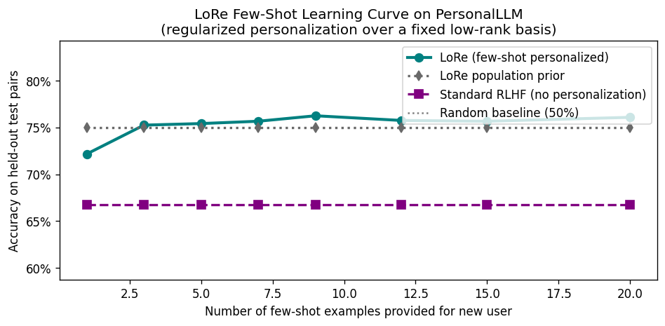
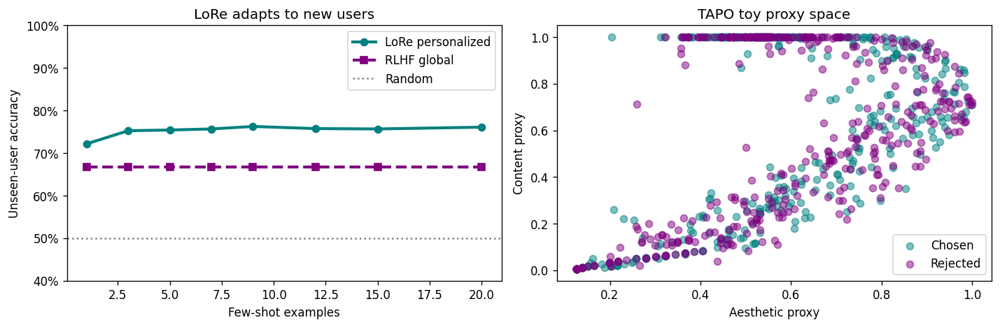

# Aligning LLMs with Human Preferences

An Advanced Deep Learning final project exploring how language model alignment changes when preferences are not universal.

This project compares a standard RLHF reward model with LoRe, a personalized low-rank reward modeling approach, and includes a small TAPO-inspired proxy demo for response style and aesthetics.

---

## Overview

Most alignment methods try to learn one reward model that represents what people prefer. But in practice, different users can value different things: clarity, detail, safety, style, or directness.

This notebook studies that problem by asking:

> Can a model adapt to individual preferences better than a single global RLHF baseline?

Using the PersonalLLM dataset from Hugging Face, the project builds a preference-learning pipeline around reward-model scores, synthetic user preferences, pairwise comparisons, and few-shot personalization.

---

## Objective

The goal is to compare three alignment ideas in one clean workflow:

| Component | Purpose |
| --- | --- |
| RLHF baseline | Learns one global reward model for everyone |
| LoRe | Learns a shared low-rank reward basis and user-specific weights |
| TAPO toy demo | Shows how content and aesthetic preference signals can be combined |

---

## Workflow

The project follows a compact alignment pipeline:

| Step | Stage | What happens |
| --- | --- | --- |
| 1 | PersonalLLM | Load prompts, responses, and reward-model scores |
| 2 | Reward matrix | Normalize response scores across 10 reward models |
| 3 | User profiles | Simulate different preference weights for each user |
| 4 | Preference pairs | Convert scores into chosen/rejected comparisons |
| 5 | RLHF baseline | Train one global Bradley-Terry reward model |
| 6 | LoRe | Learn a low-rank shared basis with user-specific weights |
| 7 | TAPO proxy | Add a toy content/style preference demonstration |
| 8 | Evaluation | Compare global alignment against personalization |

---

## Visual Results

The figures below summarize the main behavior observed in the notebook.

### Few-Shot Personalization

LoRe improves on the global RLHF baseline by adapting to new users with only a small number of preference examples.

### Final Summary

The final visualization compares LoRe personalization with the TAPO toy proxy space for chosen and rejected responses.

---

## Key Results

| Method | Evaluation | Result |
| --- | --- | --- |
| Standard RLHF | Unseen-user accuracy | 66.8% |
| LoRe, 9-shot | Unseen-user accuracy | 77.0% |
| Standard RLHF | Personalization-sensitive accuracy | 64.2% |
| LoRe, 9-shot | Personalization-sensitive accuracy | 97.2% |

LoRe performs better because it does not force every user into the same reward function. Instead, it keeps a shared reward structure and learns a small set of user-specific weights.

---

## Repository Contents

| File | Description |
| --- | --- |
| `final_project_adv_DL_.ipynb` | Main project notebook |
| `fig1_real_data_diversity.png` | Reward-model disagreement and user preference structure |
| `fig2_fewshot_curve_real.png` | LoRe few-shot learning curve |
| `fig3_tapo_toy_demo.png` | TAPO toy proxy results |
| `fig4_final_summary.png` | Final summary visualization |

---

## Conclusion

This project shows why personalization matters in alignment. A standard RLHF model can learn a useful average preference, but it struggles when users disagree. LoRe handles this more naturally by adapting to individual users through a compact low-rank representation.

The TAPO section extends the story by showing that alignment can also include softer qualities like structure, readability, and response style.
